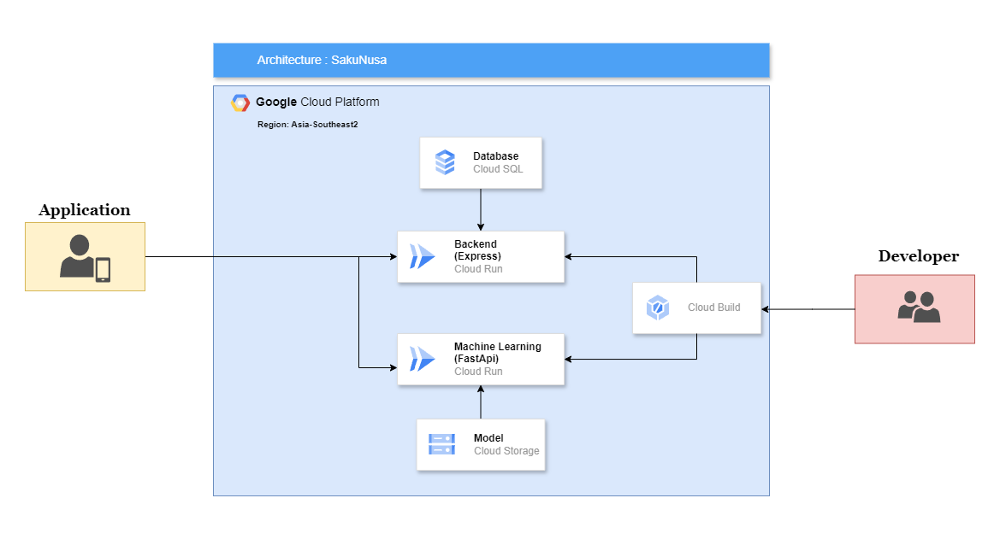

# SakuNusa Backend

### Architecture Cloud


---
### API Specification for SakuNusa
**Base URL:**
```
https://sakunusa-api-1043929878203.asia-southeast2.run.app
```

## How to run

1. Clone this repository
   
```bash
git clone https://github.com/Rivalzy/SakuNusa.git
cd sakunusa
```
2. Set up the environment
   
```bash
## Install dependencies
npm install
```

3. Run the server

```bash
npm run start
```
Server will run on port 3000

---
